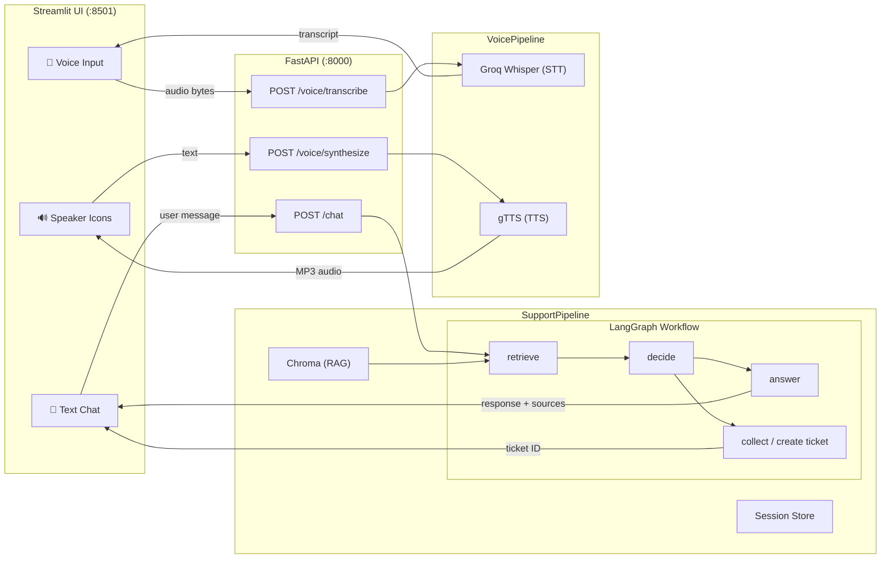

# Customer Support Ticket Agent

An AI-powered customer support agent with **voice input** and **audio playback**.

Built with **FastAPI**, **Streamlit**, **LangGraph**, and **Groq**. The agent answers policy questions using RAG (Retrieval-Augmented Generation) and collects ticket information through a multi-turn conversation flow. Voice features use **Groq Whisper** for speech-to-text and **gTTS** for text-to-speech.

> **One API key only** — a single free Groq key serves both the LLM and Whisper STT. No other credentials needed.

---

## Architecture



### Workflow

1. **Retrieve** — Searches the Chroma vector database for relevant policy documents
2. **Decide** — Uses structured LLM output to classify intent as `answer` (policy question) or `ticket` (support request)
3. **Answer** — Generates a grounded response using only retrieved context; refuses to fabricate information
4. **Ticket** — Collects customer details (name, email, description, category) over multiple turns, validates via Pydantic, creates ticket with idempotency

### Voice Flow

```
Mic → STT (Groq Whisper) → editable transcript → existing text agent
Agent response → 🔊 button click → TTS (gTTS) → audio playback
```

---

## Tech Stack

| Component | Technology | Details |
|-----------|-----------|---------|
| **LLM** | [Groq](https://console.groq.com) | `qwen/qwen3.8-27b` — open-source model, free tier |
| **Embeddings** | HuggingFace | `sentence-transformers/all-MiniLM-L6-v2` — runs locally, auto-downloads ~80 MB |
| **Vector DB** | Chroma | Local persistent storage, rebuilds from `knowledge_base/` on startup |
| **Agent Framework** | LangGraph + LangChain | Typed state graph with conditional routing |
| **STT** | Groq Whisper | `whisper-large-v3-turbo` — reuses existing Groq API key |
| **TTS** | gTTS | Google Text-to-Speech — free, no API key required |
| **API** | FastAPI | Async REST API with Pydantic validation |
| **UI** | Streamlit | Chat + voice input (`st.audio_input`) + speaker playback |

---

## Prerequisites

- **Python 3.11 or newer**
- **Groq API key** (free): Sign up at [console.groq.com](https://console.groq.com), create an API key
- ~500 MB disk space for Python packages + embedding model cache
- Internet access (for Groq API and gTTS)

No GPU, Docker, or local model server required.

---

## Quick Start

### 1. Clone the repository

```bash
git clone https://github.com/anuragpandey4/IIST-GEN-AI-Anurag-Pandey.git
cd IIST-GEN-AI-Anurag-Pandey
```

### 2. Create a virtual environment

**Windows (PowerShell):**
```powershell
py -3.11 -m venv .venv
.\.venv\Scripts\Activate.ps1
```

**Linux / macOS:**
```bash
python3 -m venv .venv
source .venv/bin/activate
```

### 3. Install dependencies

```bash
pip install -r requirements.txt
```

### 4. Configure environment

**Windows (PowerShell):**
```powershell
Copy-Item .env.example .env
```

**Linux / macOS:**
```bash
cp .env.example .env
```

Then edit `.env` and replace the placeholder with your actual Groq API key:
```
GROQ_API_KEY=gsk_your_actual_key_here
```

### 5. Start the API server (Terminal 1)

**Windows:**
```powershell
.\.venv\Scripts\Activate.ps1
uvicorn src.api.server:app --host 127.0.0.1 --port 8000
```

**Linux / macOS:**
```bash
source .venv/bin/activate
uvicorn src.api.server:app --host 127.0.0.1 --port 8000
```

> Wait until you see `Application startup complete` — the embedding model (~80 MB) downloads on first run.

### 6. Start the Streamlit UI (Terminal 2)

**Windows:**
```powershell
.\.venv\Scripts\Activate.ps1
streamlit run streamlit_app.py --server.address 127.0.0.1 --server.port 8501
```

**Linux / macOS:**
```bash
source .venv/bin/activate
streamlit run streamlit_app.py --server.address 127.0.0.1 --server.port 8501
```

### 7. Open the app

- **UI**: [http://localhost:8501](http://localhost:8501)
- **API docs**: [http://localhost:8000/docs](http://localhost:8000/docs)
- **Health check**: [http://localhost:8000/health](http://localhost:8000/health)

---

## Configuration

All settings are in `.env` (copied from `.env.example`):

| Variable | Default | Description |
|----------|---------|-------------|
| `GROQ_API_KEY` | *(required)* | Your Groq API key |
| `LLM_MODEL` | `qwen/qwen3.8-27b` | Groq model name |
| `EMBEDDING_MODEL` | `sentence-transformers/all-MiniLM-L6-v2` | HuggingFace embedding model |
| `VECTOR_DB_PATH` | `.data/vector_db` | Chroma persistence directory |
| `RAG_COLLECTION` | `customer-support` | Chroma collection name |
| `RAG_TOP_K` | `3` | Max retrieved chunks per query |
| `RAG_RELEVANCE_THRESHOLD` | `1.5` | Max L2 distance for retrieved chunks (lower = stricter) |
| `API_PORT` | `8000` | FastAPI port |
| `STREAMLIT_PORT` | `8501` | Streamlit port |

---

## Testing

Run the complete test suite (51 tests):

```bash
pytest -q
```

Run individual test suites:

```bash
pytest tests/test_session.py -v      # Session state management
pytest tests/test_tickets.py -v      # Ticket repository + validation
pytest tests/test_retriever.py -v    # RAG retrieval (uses real embeddings)
pytest tests/test_workflow.py -v     # LangGraph nodes (mocked LLM)
pytest tests/test_api.py -v          # FastAPI endpoints (mocked pipeline)
pytest tests/test_pipeline.py -v     # Pipeline orchestration
pytest tests/test_voice.py -v        # Voice pipeline (STT/TTS unit tests)
pytest tests/test_voice_api.py -v    # Voice API endpoints (mocked pipeline)
```

> **Note:** `test_retriever.py` downloads the embedding model on first run (~80 MB). All other tests use mocks and require no network access or API keys.

---

## Voice Features (Mid-Session Requirement)

### Voice Input (Speech-to-Text)

1. Click the **🎤 Record a question** microphone button to record audio
2. Audio is sent to Groq's Whisper model (`whisper-large-v3-turbo`) for transcription
3. The transcript appears in an **editable text area** — correct any errors
4. Click **✅ Send transcript** to submit through the existing text chat pipeline

### Response Playback (Text-to-Speech)

1. Every assistant response has a **🔊 Play response** button
2. Click it to generate and play audio using gTTS (Google Text-to-Speech)
3. Audio is **cached per message** — clicking again replays without re-synthesis

### Voice API Endpoints

| Endpoint | Method | Description |
|----------|--------|-------------|
| `POST /voice/transcribe` | Multipart form | Upload audio file → returns transcript JSON |
| `POST /voice/synthesize` | JSON body | Send text → returns MP3 audio bytes |

### Why These Providers?

| Provider | Why Chosen |
|----------|-----------|
| **Groq Whisper** (STT) | Reuses the existing Groq API key — one key serves both LLM and STT. Direct API call to `whisper-large-v3-turbo`, not an end-to-end platform. |
| **gTTS** (TTS) | Free, no API key required. Google Translate TTS — reliable and high quality. |

---

## Design Decisions

### Why Groq?
The assignment requires an OpenAI-compatible endpoint serving an open-source instruction model. Groq serves `qwen/qwen3.8-27b` via an OpenAI-compatible API with low latency (~200 ms). **One Groq API key serves both the LLM and Whisper STT** — no additional credentials needed.

### Why Local Embeddings + Chroma?
- No additional API keys for the evaluator
- Works offline after initial model download
- Evaluator can run everything with just one Groq API key

### Structured Output for Routing
The `decide` node uses `model.with_structured_output(IntentDecision)` to produce a Pydantic-validated `route` field. This makes routing deterministic and testable — no regex parsing of free-text LLM output.

### Ticket Idempotency
`TicketRepository` tracks one ticket per session via `_session_ticket`. Repeated create calls return the original ticket — preventing duplicates from retries or re-submissions.

---

## Knowledge Base

The agent's RAG knowledge comes from four Markdown policy documents in `knowledge_base/`:

| Document | Topic |
|----------|-------|
| `shipping.md` | Standard (3–5 days) and express (1–2 days) delivery timelines |
| `returns.md` | 30-day return window, refund processing (5–7 business days) |
| `payments.md` | Pending authorizations, duplicate charge reporting |
| `accounts.md` | Password reset, account compromise procedures |

---

## Troubleshooting

| Problem | Solution |
|---------|----------|
| `GROQ_API_KEY is missing` | Edit `.env` with your key from [console.groq.com](https://console.groq.com) |
| First startup is slow | Embedding model (~80 MB) downloads once. Subsequent starts are instant |
| `Cannot connect to the support service` | Start the FastAPI server first, then Streamlit |
| Groq rate limit errors (429) | Wait 60 seconds between requests on the free tier |
| Port conflicts | Change `API_PORT` / `STREAMLIT_PORT` in `.env` |

---

## Project Structure

```
customer_support_ticket_agent/
├── src/
│   ├── api/
│   │   └── server.py            # FastAPI routes (/health, /chat, /voice/*)
│   ├── llm/
│   │   ├── client.py            # Groq ChatGroq adapter
│   │   ├── prompts.py           # System, answer, decide, ticket prompts
│   │   └── workflow.py          # LangGraph state graph (4 nodes + routing)
│   ├── rag/
│   │   ├── document_loader.py   # Markdown loading + text splitting
│   │   ├── embeddings.py        # HuggingFace embedding adapter
│   │   └── retriever.py         # Chroma init + similarity search
│   ├── voice/
│   │   ├── contracts.py         # STTService / TTSService abstract classes
│   │   ├── models.py            # TranscriptionResponse / SynthesisRequest
│   │   ├── pipeline.py          # VoicePipeline orchestration
│   │   ├── stt.py               # Groq Whisper STT adapter
│   │   └── tts.py               # gTTS adapter
│   ├── sessions/
│   │   └── store.py             # In-memory conversation state
│   ├── tools/
│   │   └── ticket_tool.py       # Ticket repository + LangChain tool
│   ├── utils/
│   │   └── errors.py            # Custom exception classes
│   ├── config.py                # Environment-based settings
│   ├── models.py                # Pydantic request/response/ticket models
│   └── pipeline.py              # Top-level orchestration
├── tests/                       # 51 unit + integration tests
├── knowledge_base/              # 4 support policy documents
├── streamlit_app.py             # Chat + voice UI
├── requirements.txt             # Python dependencies
├── .env.example                 # Environment variable template
└── README.md
```